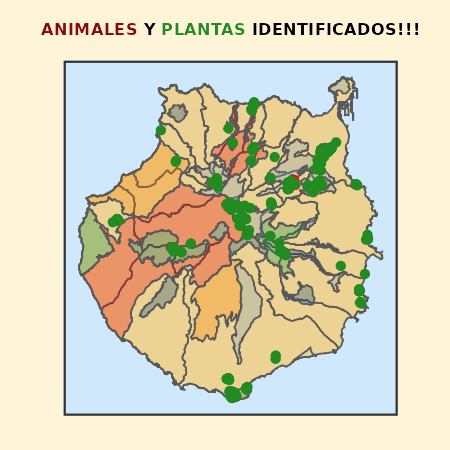
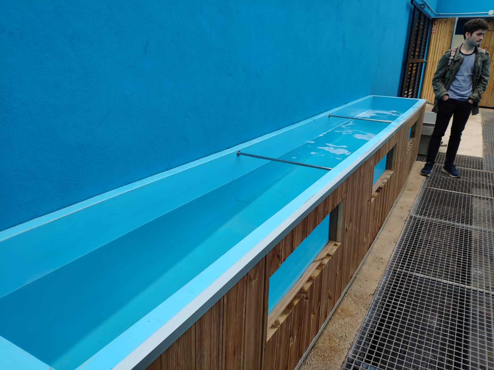
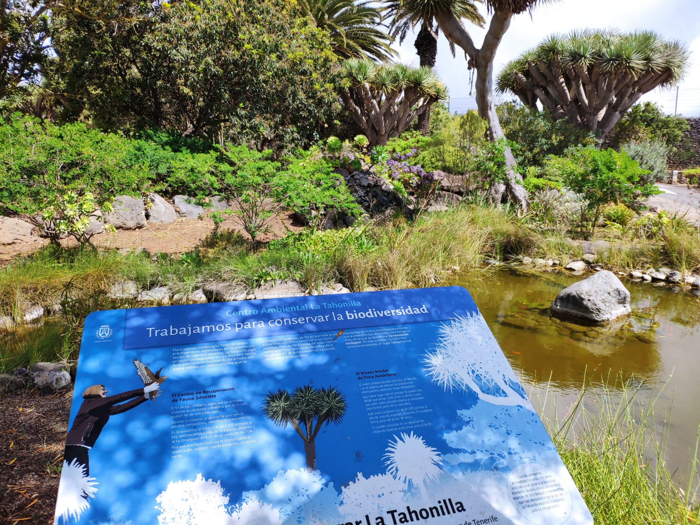



Debido a mi gran interés por la informática, he desarrollado proyectos personales enfocados en el análisis de datos, con un especial interés en datos de origen biológico. Este enfoque me ha permitido adquirir habilidades prácticas en la gestión y procesamiento de información compleja.

Comparto mis proyectos, tanto los más destacados como aquellos en los que aún estoy aprendiendo, en mi repositorio de GitHub, lo que me permite documentar y reflejar mi evolución técnica y aprendizaje continuo.

 

Proyectos 2024
===

---

## <u>Estancia en el Cabildo de Gran Canaria (Medio Ambiente)</u> 🥾 

  

### Web de Especies de la isla de Gran Canaria observadas 🐜🌱 

<strong>Descripción</strong>: Esta web fue creada para la observación de especies localizadas <i>in situ</i> mediante la toma de muestras georreferenciadas a través de fotografías con el móvil . La plataforma consta de varias páginas donde se pueden observar las especies en visores, tablas interactivas y estadísticas.

Actualmente, estoy enfocándome en la búsqueda de <u>animales invertebrados y plantas</u>, aunque no descarto incluir otros organismos en el futuro.

**Algunas habilidades aprendidas:**

* Programación: Python, R, Bash, JavaScript, CSS, HTML.
* Manejo de sistemas de flujos de trabajo (Snakemake).
* Big Data (SITECAN, Biota…).
* Desarrollo web.
* Gestor de paquetes Conda.
* Visores GIS.
* Biología: trabajo de campo, identificación de especies.
* Análisis de datos, análisis de datos espaciales.

<u><i>Visita el proyecto en:</i></u>

<button class="button" onclick="window.location.href='https://github.com/JuanCarlosBio/BiodiversidadGJC'">📚 <strong><u>Repositorio de GitHub</u></strong></button>
<button class="button" onclick="window.location.href='https://juancarlosbio.github.io/BiodiversidadGJC/'">🌐 <strong><u>Sitio WEB</u></strong></button>

---

### Web de senderos obtenidos por la aplicación IGN 🗺️

**Descripción**: En esta web comparto senderos obtenidos en formato KML a partir de archivos GPX generados con la aplicación del IGN.

He desarrollado el flujo de trabajo, pero estoy buscando mejorar el sitio web para optimizar la experiencia del usuario.

<u><i>Visita el proyecto en:</i></u>

<button class="button" onclick="window.location.href='https://github.com/JuanCarlosBio/Salidas_de_Campo_CabildoGC/'">📚 <strong><u>Repositorio de GitHub</u></strong></button>
<button class="button" onclick="window.location.href='https://juancarlosbio.github.io/Salidas_de_Campo_CabildoGC/'">🌐 <strong><u>Sitio WEB</u></strong></button>

---

### Cuadrículas para búsqueda de especies (<u>Python</u>) 🌷🐜🔍

  

**Descripción:** Flujo de Trabajo para crear cuadrículas de una superficie requerida (50x50 m 100x100m...) en los Espacios Naturales Protegidos, mediante el uso de Python. La idea es tener cuadrículas para cargar en IGN y guiarse mejor en estos espacios y anotar especies.

Con estas capas luego se pueden realizar análisis espaciales de especies identificadas (u otras observaciones) como la web que he desarrollado para la localización de especies nativas en la caldera de Bandama.
 

<u><i>Visita el proyecto en:</i></u>

<button class="button" onclick="window.location.href='https://github.com/JuanCarlosBio/Cuadriculas_Especies'">📚 <strong><u>Repositorio de GitHub</u></strong></button>
<button class="button" onclick="window.location.href='https://juancarlosbio.github.io/Cuadriculas_Especies/'">🌐 <strong><u>Sitio WEB</u></strong></button>

---

## <u>Otros proyectos personales este año</u> 

### Estudio de sequía en Canarias (estaciones NOAA) ☀️ ☁️ ☔

**Descripción**: Este proyecto se inspira en un tutorial de YouTube llamado [Riffomonas Project](https://www.youtube.com/@Riffomonas/featured) , creado por [Patrick Schloss](https://medschool.umich.edu/profile/2341/patrick-d-schloss), profesor en la University of Michigan Medical School. 

Este fue mi <u>primer proyecto de desarrollo web</u>.

<u>El objetivo final es crear un GIF que muestre la evolución de la sequía del año 2024 en comparación con los últimos 30 años de datos de las estaciones NOAA</u>.

Desgraciadamente ocurre una catástrofe en Asheville el día 28 de septiembre de 2024 debido al Huracán Helene, que asola la ciudad. Por ello los servidores de NOAA NCEI han caído: [noticia](https://www.noaa.gov/news/noaa-ncei-websites-systems-down-due-to-helene-devastation-in-asheville-nc). <u>Los servidores vuelven a funcionar a partir del día 17 de octubre de 2024</u>.

<u><i>Visita el proyecto en:</i></u>

<button class="button" onclick="window.location.href='https://github.com/JuanCarlosBio/tiempo_canarias_noaa/'">📚 <strong><u>Repositorio de GitHub</u></strong></button>
<button class="button" onclick="window.location.href='https://juancarlosbio.github.io/tiempo_canarias_noaa/'">🌐 <strong><u>Sitio WEB</u></strong></button>

---

### DASHBOARD de la meteorología de las Islas Canarias

  

He realizado un DASHBOARD para analizar la variación de las variables de <u>temperatura y precipitación acumulada</u>, proporcionados por **Sistema de Observación Meteorológica de Canarias** (datos públicos de GRAPHCAN) para ver cómo evoluciona en los próximos años. Como en otros proyectos para automatizar la descarga de datos y su procesado me ayudo de herramientas como GitHub Actions y GitHub Pages.

Entre las aplicaciones se encuentran, un mapa interactivo de canarias con la precipitación acumulada (unidades en mm), así como la temperatura del aire (ºC) para el último mes en el que se disponen datos. Aún hay cosas  que me gustaría añadir a esta WEB, pero ya está encaminada. 

<u><i>Visita el proyecto en:</i></u>

<button class="button" onclick="window.location.href='https://github.com/JuanCarlosBio/meteorologia_canarias'">📚 <strong><u>Repositorio de GitHub</u></strong></button>
<button class="button" onclick="window.location.href='https://juancarlosbio.github.io/meteorologia_canarias/'">🌐 <strong><u>Sitio WEB</u></strong></button>

---

### Análisis de Base de Datos de Tortugas Marinas usando Julia. 

  

**Descripción**: En mi último año de carrera, realicé mi Trabajo de Fin de Grado en Biología, que consistió en el análisis de una base de datos de <u>tortugas marinas varadas en Tenerife</u>, proporcionada por el Centro de Recuperación de Fauna Silvestre La Tahonilla, utilizando el <u>lenguaje de programación R</u>. Este proyecto tiene como objetivo replicar y expandir ese análisis estadístico, pero empleando el [lenguaje de programación Julia](https://julialang.org/).

Además, me introduje en el uso de frameworks para desarrollo WEB mediante el paquete [Franklin.jl](https://franklinjl.org/).

<u>Actualmente, este proyecto se encuentra en desarrollo</u>.

<u><i>Visita el proyecto en:</i></u>

<button class="button" onclick="window.location.href='https://github.com/JuanCarlosBio/turtles_julia_analysis'">📚 <strong><u>Repositorio de GitHub</u></strong></button>
<button class="button" onclick="window.location.href='https://juancarlosbio.github.io/turtles_julia_analysis/'">🌐 <strong><u>Sitio WEB</u></strong></button>

--- 

Proyectos 2023
===

## <u>Trabajo de Fin de Máster en Bioinformática (VIU)</u>🧬 👨‍💻 📈

  

**Descripción**: Este proyecto consistió en desarrollar un flujo de trabajo para el análisis <u>bioinformático de Next Generation Sequencing</u> utilizando el software [SNAKEMAKE](https://snakemake.github.io/), un gestor de flujos de trabajo basado en GNUmake. Snakemake es ideal para automatizar y hacer reproducibles los procesos bioinformáticos, destacando por su sintaxis en Python, lo que facilita su aprendizaje y comprensión.  

<u><i>Visita el proyecto en:</i></u>

<button class="button" onclick="window.location.href='https://github.com/JuanCarlosBio/TFM'">📚 <strong><u>Repositorio de GitHub</u></strong></button>

---

## <u>Otras asignaturas del máster (2023)</u> 🧬 👨‍💻 📈

  

### Actividades de Trasncriptómica (VIU)

**Descripción**: Código empleado para resolver los problemas de la asignatura Trascriptómica (RNA-SEQ).

<u><i>Visita el proyecto en:</i></u>

<button class="button" onclick="window.location.href='https://github.com/JuanCarlosBio/RNA-Seq_VIU'">📚 <strong><u>Repositorio de GitHub</u></strong></button>

---

Proyectos 2022
===

## <u>Otras asignaturas del máster (2022)</u> 🧬 👨‍💻 📈

  

### Actividades de Programación en Python y R (VIU)

**Descripción**: Código empleado para resolver los problemas de la asignatura Programación en los Lenguaje de Programación [Python](https://www.python.org/) y [R](https://www.r-project.org/).

<u><i>Visita el proyecto en:</i></u>

<button class="button" onclick="window.location.href='https://github.com/JuanCarlosBio/Programacion_Python_R'">📚 <strong><u>Repositorio de GitHub</u></strong></button>

---

### Actividades de Programación en Shell Scripting / BASH (VIU)

  

**Descripción**: Código empleado para resolver los problemas de la asignatura Programación en Shell Scripting, en concreto aprendimos a usar el interprete <u>BASH SHELL</u>.

Cabe destacar que me especialicé además en el *Sistema Operativo <u>Linux</u>*, lo que me ha ayudado a mejorar en proyectos de análisis de datos.

<u><i>Visita el proyecto en:</i></u>

<button class="button" onclick="window.location.href='https://github.com/JuanCarlosBio/Programacion_Shell_Scripting_VIU'">📚 <strong><u>Repositorio de GitHub</u></strong></button>

---

## <u>Trabajo de Fin de Grado en Biología</u> 

### *Análsis estadístico de tortugas marinas varadas en Tenerife, Islas Canarias* 

  
    <figcaption style="font-size: 12px;" align="center">Visita para ver las tortugas en La Tahonilla.</figcaption>

**Descripción**: Tras aprender programación en R de forma autodidacta, puse a prueba mis habilidades analizando una base de datos de tortugas marinas varadas, proporcionada por el Centro de Recuperación de Fauna Silvestre La Tahonilla del Cabildo de Tenerife.

Este proyecto me permitió demostrar competencias en programación, análisis estadístico, visualización de datos y más.

Además, aprendí de forma autodidacta a utilizar <u>Git y GitHub</u> para el control de versiones, almacenando mi código y compartiéndolo con mi tutor y el tribunal.

<u><i>Visita el proyecto en:</i></u>

<button class="button" onclick="window.location.href='https://github.com/JuanCarlosBio/Tortugas_La_Tahonilla'">📚 <strong><u>Repositorio de GitHub</u></strong></button>

--- 

Proyectos de 2021
===

### Asignaturas de Cuarto de Carrera del Grado en Biología ULL

Aprendí programación de forma autodidacta para analizar los datos de mis últimas asignaturas de cuarto de carrera. <u>Comencé con el lenguaje de programación R</u>, y conservo el código utilizado para los análisis. Además, lo he empleado para experimentar y aplicar nuevos conocimientos, realizando modificaciones y explorando diferentes enfoques.

* <u>Asignaturas optativas para la especialidad:</u> 
  * 🐁 Fisiología Animal Aplicada
  * 🌱 Aplicaciones de la Fisiología Vegetal
  * 🧫 Microbiología Aplicada
  * 🧪 Avances en Bioquímica y Biología Molecular 
  * 🧬 Genética Evolutiva.

<u><i>Visita el proyecto en:</i></u>

<button class="button" onclick="window.location.href='https://github.com/JuanCarlosBio/cuarto_carrera'">📚 <strong><u>Repositorio de GitHub</u></strong></button>

---
