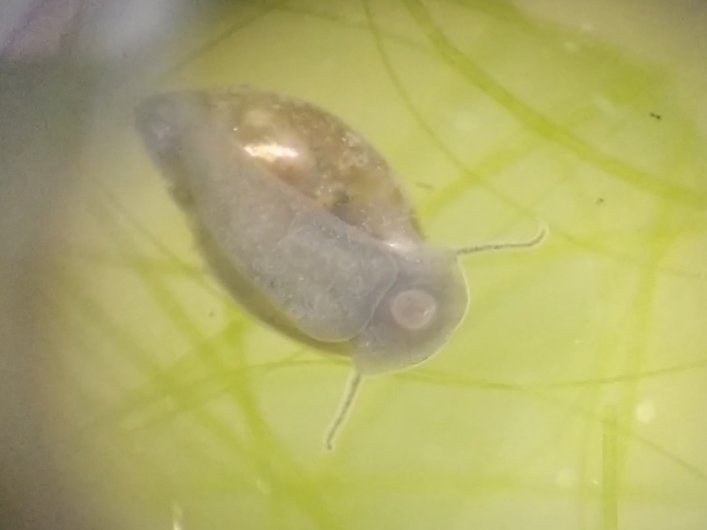
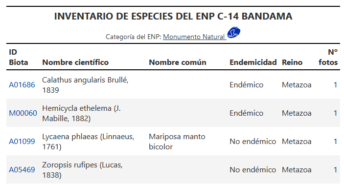



Debido a mi gran interés por la informática, he desarrollado proyectos personales enfocados en el análisis de datos, con un especial interés en datos de origen biológico. Este enfoque me ha permitido adquirir habilidades prácticas en la gestión y procesamiento de información compleja.

Comparto mis proyectos, tanto los más destacados como aquellos en los que aún estoy aprendiendo, en mi repositorio de GitHub, lo que me permite documentar y reflejar mi evolución técnica y aprendizaje continuo.

# Tabla de contenidos:
1. [Poryectos de 2025](#proyectos-de-2025)
    1.1. [Ecosistemas naturales: <u>terrarios y ecoesferas</u> 🔬🐜🌱](#ecosistemas-naturales-terrarios-y-ecoesferas-)
2. [Poryectos de 2024](#proyectos-de-2024)
    2.1. [Web de especies de la isla de Gran Canaria observadas 🐜🌱](#web-de-especies-de-la-isla-de-gran-canaria-observadas-)
    2.2. [Inventario de Espacios Naturales Protegidos de Gran Canaria 📋](#inventario-de-espacios-naturales-protegidos-de-gran-canaria-)
    2.3. [Cuadrículas para búsqueda de especies (<u>Python</u>) 🌷🐜🔍](#cuadrículas-para-búsqueda-de-especies-python-)
    2.4. [Estudio de sequía en Canarias (estaciones NOAA) ☀️ ☁️ ☔](#estudio-de-sequía-en-canarias-estaciones-noaa-️-️-)
    2.5. [Dashboard de la meteorología de las Islas Canarias](#dashboard-de-la-meteorología-de-las-islas-canarias)
    2.6. [Análisis de Base de Datos de Tortugas Marinas usando Julia](#análisis-de-base-de-datos-de-tortugas-marinas-usando-julia)
3. [Poryectos de 2023](#proyectos-de-2023)
    3.1. [<u>Trabajo de Fin de Máster en Bioinformática (VIU)</u>🧬 👨‍💻 📈](#trabajo-de-fin-de-máster-en-bioinformática-viu--)
    3.2. [Actividades de Trasncriptómica (VIU)](#actividades-de-trasncriptómica-viu)
4. [Poryectos de 2022](#proyectos-de-2022)
    4.1. [Actividades de Programación en Python y R (VIU)](#actividades-de-programación-en-python-y-r-viu)
    4.2. [Actividades de Programación en Shell Scripting / BASH (VIU)](#actividades-de-programación-en-shell-scripting--bash-viu)
    4.3. [Análsis estadístico de tortugas marinas varadas en Tenerife, Islas Canarias](#análsis-estadístico-de-tortugas-marinas-varadas-en-tenerife-islas-canarias)
5. [Poryectos de 2021](#proyectos-de-2021)
    5.1. [Asignaturas de Cuarto de Carrera del Grado en Biología ULL](#asignaturas-de-cuarto-de-carrera-del-grado-en-biología-ull)

---

# **Proyectos de 2025**

## Ecosistemas naturales: <u>terrarios y ecoesferas</u> 🔬🐜🌱

Durante bastante tiempo me ha interesado la creación de **ecosistemas naturales autosostenibles**, tanto <u>acuáticos como terrestres</u>, en frascos sellados. Está basado en el concepto de *"[ecoesfera](https://es.wikipedia.org/wiki/Ecoesfera)"*.

  

  
  <figcaption style="text-align: center;">
    
Especie de caracol posiblemente <i>Physella acuta</i>

  </figcaption>

<u><strong>Ecoesfera acuática</strong></u>: *Simulación de un ambiente acuático*. Se realiza una salida de campo para recoger muestras de agua estancada, asegurando obtener sustrato con microorganismos, fauna, algas y plantas que realicen la fotosíntesis para mantener el ecosistema.

<u><strong>Terrario</strong></u>: *Simulación de un ambiente terrestre*. Primero se coloca una capa de drenaje, como grava, seguida de una capa de tierra muestreada que contiene microbios, plantas y fauna que darán vida al ecosistema.

Mi objetivo es montar un laboratorio casero, invirtiendo en un equipo de grabación para observar los organismos en cada frasco y estudiar cómo evolucionan los ecosistemas hasta estabilizarse. Esto me permitirá profundizar en principios de ecología y técnicas analíticas de laboratorio mediante distintos experimentos.

Una vez tenga el equipo, me gustaría compartir mis descubrimientos en redes sociales.

  

---

# **Proyectos de 2024**

## <u>Estancia en el Cabildo de Gran Canaria (Medio Ambiente)</u> 🥾 

  

### Web de especies de la isla de Gran Canaria observadas 🐜🌱 

<strong>Descripción</strong>: Esta web fue creada para la observación de especies localizadas <i>in situ</i> de salidas de campo, mediante la toma de muestras georreferenciadas a través de fotografías con el móvil . La plataforma consta de varias páginas donde se pueden observar las especies en visores, tablas interactivas y estadísticas.

Actualmente, estoy enfocándome en la búsqueda de <u>animales invertebrados y plantas</u>, aunque no descarto incluir otros organismos en el futuro.

**Algunas habilidades aprendidas:**

* Uso de herramiantas para investigación reproducible (*<u>"reproducible research"</u>*).
* Programación: Python, R, Bash, JavaScript, CSS, HTML.
* Manejo de sistemas de flujos de trabajo (snakemake).
* Automatización de tareas.
* Big Data ([SITCAN](https://opendata.sitcan.es/), [BIOCAN](https://www.biodiversidadcanarias.es/)).
* Desarrollo web, mantenimiento y depuración.
* Gestor de paquetes Conda.
* Git y GitHub (GitHub Actions, GitHub Pages)
* Visores GIS.
* Biología: trabajo de campo, identificación de especies.
* Visualización y análisis de datos biológicos y espaciales.
* SQL/MySQL: diseño y gestión de bases de datos. Actualmente trabajo en la creación de una base de datos de especies, integrando datos de BIOCAN y SITCAN mediante consultas y tablas relacionadas.

<u><i>Visita el proyecto en:</i></u>

<button class="button" onclick="window.location.href='https://github.com/JuanCarlosBio/BiodiversidadGJC'">📚 <strong><u>Repositorio de GitHub</u></strong></button>
<button class="button" onclick="window.location.href='https://juancarlosbio.github.io/BiodiversidadGJC/'">🌐 <strong><u>Sitio WEB</u></strong></button>

---

### Inventario de Espacios Naturales Protegidos de Gran Canaria 📋

  
    <figcaption style="font-size: 12px;" align="center">
      Primeras líneas del <a href='https://juancarlosbio.github.io/inventario_especies_enp/html_enp/monumento_natural/C-14_bandama.html'>inventario del Monumento Natural de C-14 Bandama</a>.
    </figcaption>

A partir de los datos de la web de especies, he creado una base de datos en MySQL, en la cual he realizado diversas consultas hasta estructurar tablas que contienen las especies que he observado en los Espacios Naturales Protegidos de la isla de Gran Canaria.

Lo que realmente distingue este proyecto es que lo he utilizado principalmente para <u><strong>aprender a realizar consultas SQL y gestionar contenedores Docker</strong></u>. Estos contenedores me permiten mantener un entorno estable y compatible con las versiones necesarias para ejecutar mi software de manera continua.

Finalmente, he desarrollado una interfaz web sencilla para visualizar los datos, aunque, en este caso, lo que realmente me interesa es la información recopilada en sí misma.

<u><i>Visita el proyecto en:</i></u>

<button class="button" onclick="window.location.href='https://github.com/JuanCarlosBio/inventario_especies_enp'">📚 <strong><u>Repositorio de GitHub</u></strong></button>
<button class="button" onclick="window.location.href='https://juancarlosbio.github.io/inventario_especies_enp/'">🌐 <strong><u>Sitio WEB</u></strong></button>

---

### Cuadrículas para búsqueda de especies (<u>Python</u>) 🌷🐜🔍

  

**Descripción:** Flujo de Trabajo para crear cuadrículas de una superficie requerida (50x50 m 100x100m...) en los Espacios Naturales Protegidos, mediante el uso de Python. La idea es tener cuadrículas para cargar en IGN y guiarse mejor en estos espacios y anotar especies.

Con estas capas luego se pueden realizar análisis espaciales de especies identificadas (u otras observaciones) como la web que he desarrollado para la localización de especies nativas en la caldera de Bandama.

A partir de este software, estoy desarrollando una capa de especies a una resolución de 50 m x 50 m (en formatos GPKG, KML y SHP) del <u><strong>Sitio de Interés Científico de Jinámar C-29</strong></u>. Además, estoy creando una aplicación web interactiva para analizar el inventario, que será útil para la gestión del espacio

<u><i>Visita el proyecto en:</i></u>

<button class="button" onclick="window.location.href='https://github.com/JuanCarlosBio/Cuadriculas_Especies'">📚 <strong><u>Repositorio de GitHub</u></strong></button>
<button class="button" onclick="window.location.href='https://juancarlosbio.github.io/Cuadriculas_Especies/'">🌐 <strong><u>Sitio WEB</u></strong></button>

---

## <u>Otros proyectos personales este año</u> 

### Estudio de sequía en Canarias (estaciones NOAA) ☀️ ☁️ ☔

**Descripción**: Este proyecto se inspira en un tutorial de YouTube llamado [Riffomonas Project](https://www.youtube.com/@Riffomonas/featured) , creado por [Patrick Schloss](https://medschool.umich.edu/profile/2341/patrick-d-schloss), profesor en la University of Michigan Medical School. 

<u>El objetivo final es crear un GIF</u> que muestre la evolución de la sequía del año 2024 en comparación con los últimos 30 años de datos de las estaciones NOAA.

Desgraciadamente ocurre una catástrofe en Asheville el día 28 de septiembre de 2024 debido al Huracán Helene, que asola la ciudad. Por ello los servidores de NOAA NCEI han caído ([noticia](https://www.noaa.gov/news/noaa-ncei-websites-systems-down-due-to-helene-devastation-in-asheville-nc)). <u>Los servidores vuelven a funcionar a partir del día 17 de octubre de 2024</u>.

<u><i>Visita el proyecto en:</i></u>

<button class="button" onclick="window.location.href='https://github.com/JuanCarlosBio/tiempo_canarias_noaa/'">📚 <strong><u>Repositorio de GitHub</u></strong></button>
<button class="button" onclick="window.location.href='https://juancarlosbio.github.io/tiempo_canarias_noaa/'">🌐 <strong><u>Sitio WEB</u></strong></button>

---

### Dashboard de la meteorología de las Islas Canarias

He realizado un dashboard para analizar la variación de las variables de <u>temperatura y precipitación acumulada</u>, proporcionados por **Sistema de Observación Meteorológica de Canarias** (datos públicos de GRAPHCAN) para ver cómo evoluciona en los próximos años. Como en otros proyectos para automatizar la descarga de datos y su procesado me ayudo de herramientas como GitHub Actions y GitHub Pages.

La razón original de este proyecto es que durante mi estancia en el cabildo, he contribuido a la realización de obras de plantanción de especies vegetales. Teniendo en cuenta de que ha sido un año seco, y siendo la lluvia un recurso natural importante para que salgan adelante las plantaciones, puede ser interesante una herramienta que obtenga datos de variables como la temperatura y la precipitación acumulada.

Entre las aplicaciones se encuentran, un mapa interactivo de canarias con la precipitación acumulada (unidades en mm), así como la temperatura del aire (ºC) para el último mes en el que se disponen datos. Aún hay cosas  que me gustaría añadir a esta WEB, pero ya está encaminada. 

  

<u><i>Visita el proyecto en:</i></u>

<button class="button" onclick="window.location.href='https://github.com/JuanCarlosBio/meteorologia_canarias'">📚 <strong><u>Repositorio de GitHub</u></strong></button>
<button class="button" onclick="window.location.href='https://juancarlosbio.github.io/meteorologia_canarias/'">🌐 <strong><u>Sitio WEB</u></strong></button>

---

### Análisis de Base de Datos de Tortugas Marinas usando Julia. 

  

**Descripción**: En mi último año de carrera, realicé mi Trabajo de Fin de Grado en Biología, que consistió en el análisis de una base de datos de <u>tortugas marinas varadas en Tenerife</u>, proporcionada por el Centro de Recuperación de Fauna Silvestre La Tahonilla, utilizando el <u>lenguaje de programación R</u>. Este proyecto tiene como objetivo replicar y expandir ese análisis estadístico, pero empleando el [lenguaje de programación Julia](https://julialang.org/).

Además, me introduje en el uso de frameworks para desarrollo WEB mediante el paquete [Franklin.jl](https://franklinjl.org/).

<u>Actualmente, este proyecto se encuentra en desarrollo</u>.

<u><i>Visita el proyecto en:</i></u>

<button class="button" onclick="window.location.href='https://github.com/JuanCarlosBio/turtles_julia_analysis'">📚 <strong><u>Repositorio de GitHub</u></strong></button>
<button class="button" onclick="window.location.href='https://juancarlosbio.github.io/turtles_julia_analysis/'">🌐 <strong><u>Sitio WEB</u></strong></button>

--- 

# **Proyectos de 2023**

## <u>Trabajo de Fin de Máster en Bioinformática (VIU)</u>🧬 👨‍💻 📈

  

**Descripción**: Este proyecto consistió en desarrollar un flujo de trabajo para el análisis <u>bioinformático de Next Generation Sequencing</u>, para la indentificación de variantes genómicas de una familia con historial de poliposis adenomatosa familiar (área de la salud), utilizando el software [SNAKEMAKE](https://snakemake.github.io/), un gestor de flujos de trabajo basado en GNUmake. Snakemake es ideal para automatizar y hacer reproducibles los procesos bioinformáticos, destacando por su <u>sintaxis en Python</u>, lo que facilita su aprendizaje y comprensión.  

<u><i>Visita el proyecto en:</i></u>

**Algunas habilidades aprendidas:**

* Investigación reproducible (*"reproducible research"*)
* Programación: Python, R, Bash.
* Manejo de sistemas de flujos de trabajo (Snakemake), aprendiendo lo básico por cuenta propia a partir de la [documentación](https://snakemake.readthedocs.io/en/stable/) de la herramienta.
* Automatización de tareas.
* Big Data (**<i>Next Generation Sequencing</i>**).
* Gestor de paquetes Conda.
* Secuenciación Genómica, protocolos básicos (FastQC, FastP, Alineamiento Bwa...)
* Manejo de archivos relacionados con la Bioinformática (FASTQ, SAM, BAM, VCF).
* Visores Genómicos: IGV.
* Visualización y análisis de datos.

<button class="button" onclick="window.location.href='https://github.com/JuanCarlosBio/TFM'">📚 <strong><u>Repositorio de GitHub</u></strong></button>

---

## <u>Otras asignaturas del máster (2023)</u> 🧬 👨‍💻 📈

  

### Actividades de Trasncriptómica (VIU)

**Descripción**: Código empleado para resolver los problemas de la asignatura Trascriptómica (RNA-SEQ).

<u><i>Visita el proyecto en:</i></u>

<button class="button" onclick="window.location.href='https://github.com/JuanCarlosBio/RNA-Seq_VIU'">📚 <strong><u>Repositorio de GitHub</u></strong></button>

---

# **Proyectos de 2022**

## <u>Otras asignaturas del máster (2022)</u> 🧬 👨‍💻 📈

  

### Actividades de Programación en Python y R (VIU)

**Descripción**: Código empleado para resolver los problemas de la asignatura Programación en los Lenguaje de Programación [Python](https://www.python.org/) y [R](https://www.r-project.org/).

<u><i>Visita el proyecto en:</i></u>

<button class="button" onclick="window.location.href='https://github.com/JuanCarlosBio/Programacion_Python_R'">📚 <strong><u>Repositorio de GitHub</u></strong></button>

---

### Actividades de Programación en Shell Scripting / BASH (VIU)

  

**Descripción**: Código empleado para resolver los problemas de la asignatura Programación en Shell Scripting, en concreto aprendimos a usar el interprete <u>BASH SHELL</u>.

Cabe destacar que me especialicé además en el *Sistema Operativo <u>Linux</u>*, lo que me ha ayudado a mejorar en proyectos de análisis de datos.

<u><i>Visita el proyecto en:</i></u>

<button class="button" onclick="window.location.href='https://github.com/JuanCarlosBio/Programacion_Shell_Scripting_VIU'">📚 <strong><u>Repositorio de GitHub</u></strong></button>

---

## <u>Trabajo de Fin de Grado en Biología</u> 

### *Análsis estadístico de tortugas marinas varadas en Tenerife, Islas Canarias* 

  
    <figcaption style="font-size: 12px;" align="center">Visita para ver las tortugas en La Tahonilla.</figcaption>

**Descripción**: Tras aprender programación en R de forma autodidacta, puse a prueba mis habilidades analizando una base de datos de tortugas marinas varadas, proporcionada por el Centro de Recuperación de Fauna Silvestre La Tahonilla del Cabildo de Tenerife.

Este proyecto me permitió demostrar competencias en programación, análisis estadístico, visualización de datos y más.

Además, aprendí de forma autodidacta a utilizar <u>Git y GitHub</u> para el control de versiones, almacenando mi código y compartiéndolo con mi tutor y el tribunal.

**Algunas habilidades aprendidas:**

* Aprendizaje autónomo de programación: R.
* Análisis bioestadístico:
  * Inferencia estadística, contraste de hipótesis.
  * Aprendizaje automático no supervisado.
  * Predicción mediante <u>modelo de series temporales</u> (SARIMA).
* Visualización y análisis de datos.
* Iniciación con Git y GitHub.

<u><i>Visita el proyecto en:</i></u>

<button class="button" onclick="window.location.href='https://github.com/JuanCarlosBio/Tortugas_La_Tahonilla'">📚 <strong><u>Repositorio de GitHub</u></strong></button>

--- 

# **Proyectos de 2021**

### Asignaturas de Cuarto de Carrera del Grado en Biología ULL

Aprendí programación de forma autodidacta para analizar los datos de mis últimas asignaturas de cuarto de carrera. <u>Comencé con el lenguaje de programación R</u>, y conservo el código utilizado para los análisis. Además, lo he empleado para experimentar y aplicar nuevos conocimientos, realizando modificaciones y explorando diferentes enfoques.

* <u>Asignaturas optativas para la especialidad:</u> 
  * 🐁 Fisiología Animal Aplicada
  * 🌱 Aplicaciones de la Fisiología Vegetal
  * 🧫 Microbiología Aplicada
  * 🧪 Avances en Bioquímica y Biología Molecular 
  * 🧬 Genética Evolutiva.

<u><i>Visita el proyecto en:</i></u>

<button class="button" onclick="window.location.href='https://github.com/JuanCarlosBio/cuarto_carrera'">📚 <strong><u>Repositorio de GitHub</u></strong></button>

---
