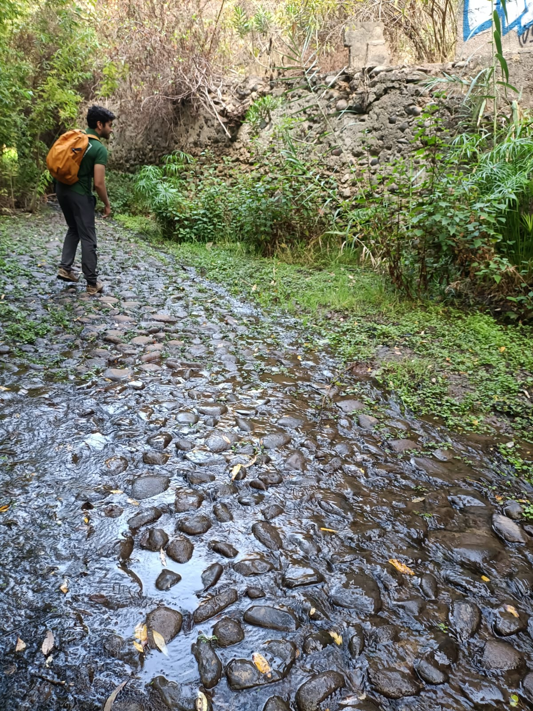
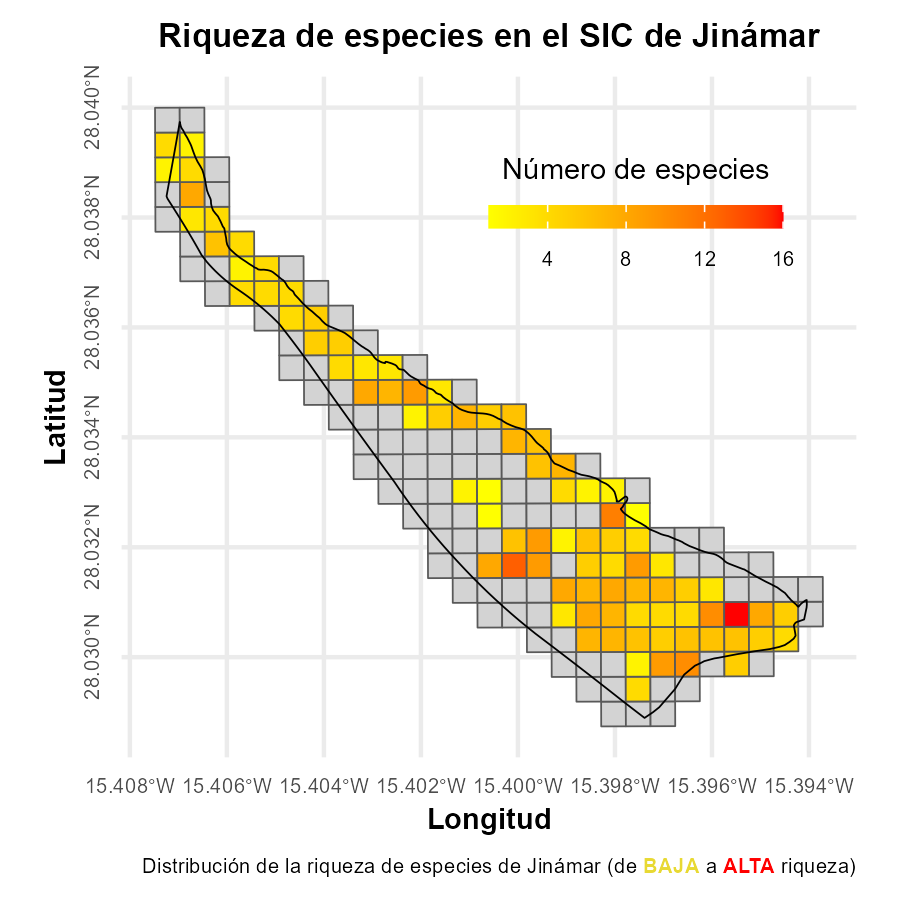



Feb 2024 - <u>ACTUALIDAD Cabildo Insular de Gran Canaria</u>
===

  

Actualmente me han ofrecido un contrato laboral de un año en el <u><strong>Cabildo Insular de Gran Canaria</strong></u>, en el <u><strong>Servicio Técnico de Medio Ambiente</strong></u> gracias a la oportunidad proporcionada por el proyecto Nuevas Oportunidades de Empleo (NOE). En concreto, mi puesto se trata de <u><strong>Técnico de Medio Ambiente, Graduado en Biología</strong></u>

## Labores y habilidades del oficio:

  
    <figcaption style="font-size: 12px;" align="center">
      Aventuras por el Barranco de Azuaje.
    </figcaption>

### 📋 *Redacción de Informes Técnicos*

La principal tarea del puesto consiste en la gestión pública mediante la redacción de informes técnicos para evaluar la compatibilidad de actuaciones (obras, actividades, celebraciones...) según la normativa vigente de los <u><i>Espacios Naturales Protegidos</i></u>. Con esto, se toman decisiones a nivel técnico-ambiental sobre la compatibilidad o incompatibilidad de dichas actuaciones.

### 🥾 *Salidas de campo*

Muchas veces es necesario acudir al lugar de la actuación para comprobar las intervenciones que se desean realizar y obtener una mejor idea de lo que se pretende hacer. De esta manera, he aprendido la importancia de la atención al detalle que se requiere como técnico, así como el valor de la comunicación con otros compañeros de equipo y con los propios solicitantes del encargo.

### Otras tareas por iniciativa propia: 📊 *Análisis de datos*

 

Propuse desarrollar una aplicación para llevar un inventario de especies en el Espacio Natural Protegido <u><strong>Sitio de Interés Científico de Jinámar C-29</strong></u>. Esta tarea incluyó el muestreo a través de salidas de campo y el posterior análisis de los datos recopilados.

La aplicación presenta <u>tablas, gráficas y mapas interactivos GIS</u> que permiten visualizar y analizar información clave, como la riqueza de especies y la presencia de especies invasoras.

Desarrollé personalmente las cuadrículas base utilizadas en la aplicación, y el código fuente está disponible públicamente en mi repositorio de GitHub: [Código fuente](https://github.com/JuanCarlosBio/Cuadriculas_Especies/blob/main/workflow.ipynb). Si les interesa ver el resto del código de la aplicación y el resultado final, contacten conmigo.

Además, he estado trabajando en una base de datos en Excel para gestionar y controlar las actividades realizadas por una de las empresas contratadas por el Cabildo, GESPLAN (S.A.). Esta base de datos facilita el seguimiento de los materiales utilizados y permite analizar los datos (en un periodo del 2023 al 2024) para estimar costos en futuros encargos y optimizar la gestión económica de los proyectos.

---

Feb 2022 - Abr2 022 Animalario y estabulario del Servicio General de Apoyo a la investigación (SEGAI) ULL
===

Mi primera experiencia como profesional fue como <u><strong>técnico de estabulario - animalario</strong></u> 🐁.

  
  <figcaption style="font-size: 12px;" align="center">Primera experiencia en el SEGAI.</figcaption>

## <strong>Labores y habilidades del oficio</strong>:

**Mantenimiento y cuidado de los animales**, incluyendo la cría de ratas y ratones, el cambio de jaulas y la administración de medicación, siempre siguiendo estrictamente los protocolos de bienestar animal.

**Mantenimiento de las instalaciones y equipos**, incluyendo la limpieza de jaulas de diversas especies (ratas, conejos y ranas), la reparación de equipamientos y la redacción de protocolos de uso de los equipos.

**Labores de laboratorio**, centradas en la producción de medicamentos para animales y la observación microscópica de tejidos de rata y ratón para realizar diagnósticos.

**Tareas veterinarias**, como la manipulación de animales, la administración de medicación y la realización de procedimientos quirúrgicos.
